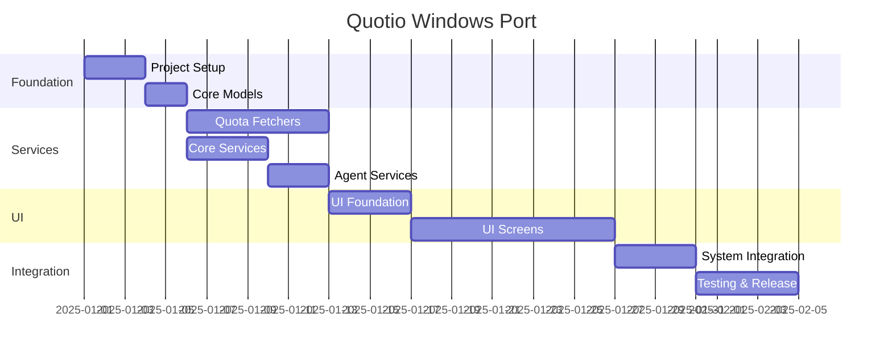

# Quotio Windows Port - Master Plan

> **Target**: Full feature parity with macOS version  
> **Tech Stack**: .NET 8, WPF, MVVM  
> **Estimated Duration**: 4-6 weeks

---

## Phase Overview

| Phase | Name | Duration | Files |
|-------|------|----------|-------|
| 1 | [Project Setup](01-project-setup.md) | 2-3 days | Solution structure |
| 2 | [Core Models](02-core-models.md) | 1-2 days | Data models, enums |
| 3 | [Quota Fetchers](03-quota-fetchers.md) | 5-7 days | 7 provider fetchers |
| 4 | [Core Services](04-core-services.md) | 3-4 days | Proxy, API client |
| 5 | [Agent Services](05-agent-services.md) | 2-3 days | Agent detection/config |
| 6 | [UI Foundation](06-ui-foundation.md) | 3-4 days | Layout, navigation |
| 7 | [UI Screens](07-ui-screens.md) | 7-10 days | All 8 screens |
| 8 | [System Integration](08-system-integration.md) | 3-4 days | Tray, notifications |
| 9 | [Testing & Release](09-testing-release.md) | 3-5 days | Tests, installer |

---

## Quick Start

```bash
# After Phase 1 is complete:
cd c:\Users\Admin\Documents\quotio\QuotioWindows
dotnet build
dotnet run --project src/Quotio.App
```

---

## Architecture

```
┌─────────────────────────────────────────────────────────────┐
│                    Quotio.App (WPF)                         │
├─────────────────────────────────────────────────────────────┤
│  Views (XAML)  │  ViewModels  │  Controls  │  Resources     │
├─────────────────────────────────────────────────────────────┤
│                    Quotio.Services                          │
│  QuotaFetchers  │  Proxy  │  Agents  │  System              │
├─────────────────────────────────────────────────────────────┤
│                    Quotio.Core                              │
│  Models  │  Enums  │  Interfaces  │  Constants              │
├─────────────────────────────────────────────────────────────┤
│                    Quotio.Tests                             │
│  Unit Tests  │  Integration Tests                           │
└─────────────────────────────────────────────────────────────┘
```

---

## Key Dependencies

| Package | Version | Purpose |
|---------|---------|---------|
| CommunityToolkit.Mvvm | 8.2.2 | MVVM framework |
| Hardcodet.NotifyIcon.Wpf | 1.1.0 | System tray |
| Microsoft.Toolkit.Uwp.Notifications | 7.1.3 | Toast notifications |
| MaterialDesignThemes | 5.0.0 | Modern UI styling |
| Newtonsoft.Json | 13.0.3 | JSON parsing |
| Squirrel.Windows | 2.0.1 | Auto-update |

---

## Implementation Order



---

## Files Index

- [01-project-setup.md](01-project-setup.md) - Solution creation, NuGet setup
- [02-core-models.md](02-core-models.md) - Data models, enums, interfaces
- [03-quota-fetchers.md](03-quota-fetchers.md) - All 7 provider quota fetchers
- [04-core-services.md](04-core-services.md) - Proxy, HTTP client, settings
- [05-agent-services.md](05-agent-services.md) - Agent detection & configuration
- [06-ui-foundation.md](06-ui-foundation.md) - MainWindow, navigation, themes
- [07-ui-screens.md](07-ui-screens.md) - All 8 application screens
- [08-system-integration.md](08-system-integration.md) - Tray, notifications, auto-start
- [09-testing-release.md](09-testing-release.md) - Unit tests, installer, docs
